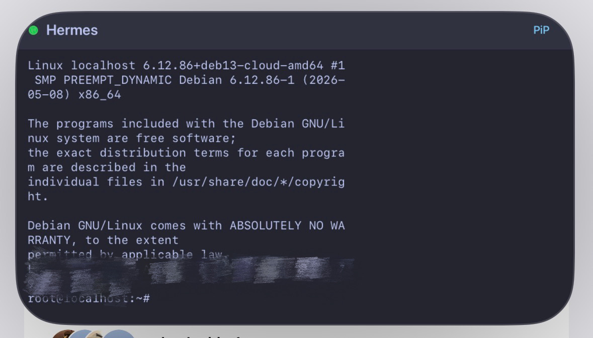
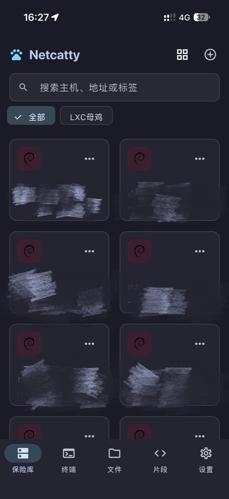
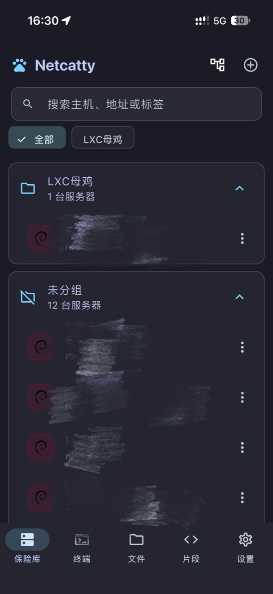
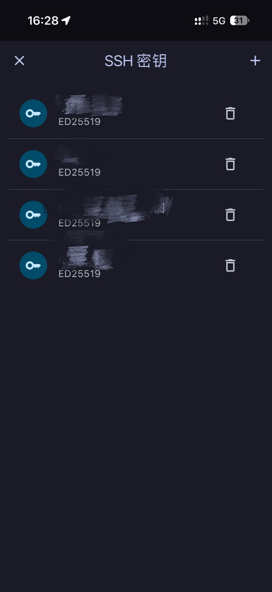
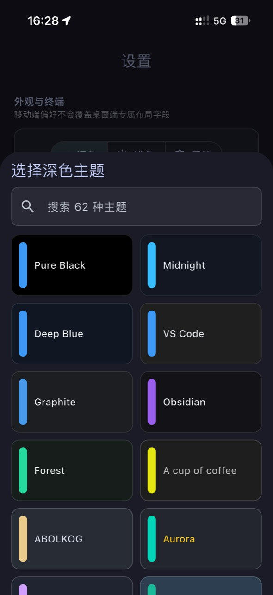
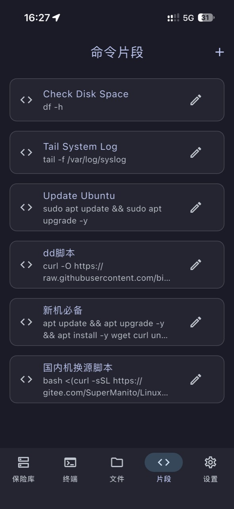
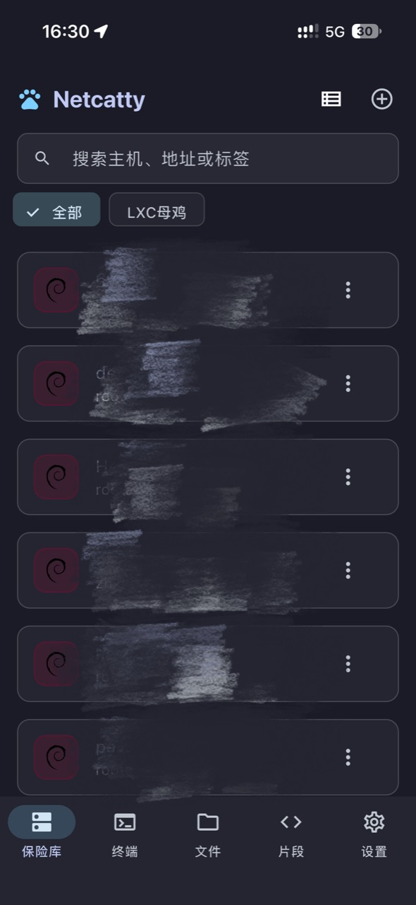

# Netcatty Mobile

Netcatty 的 Android / iOS 移动端实现：一个面向服务器管理、SSH 终端、SFTP 文件管理和远程运维的开源工作台。

项目延续桌面版 Netcatty 的深色工作台设计、Vault 数据模型和 `netcatty-vault.json` 加密同步格式，并针对触屏、多任务、移动文件系统和系统安全存储重新实现交互。

[](https://github.com/kmh1145/Netcatty-mobile/actions/workflows/mobile.yml)
[](https://github.com/kmh1145/Netcatty-mobile/releases/latest)
[](LICENSE)

## 软件特色

- **完整的移动连接管理**：可直接在手机上新增和编辑 SSH、Telnet 连接，配置密码、私钥、私钥口令、跳板机、HTTP/SOCKS5 代理、启动命令、环境变量、保活和连接超时。
- **为触屏设计的终端**：支持同一服务器多个标签页、拖动排序、分屏、全屏、可调文本选区与复制、中文输入、系统安全键盘、可作用于软键盘的 Ctrl/Alt/Shift、自定义快捷键、画中画、连接终止和 Android 前台服务保活。
- **单栏 / 双栏 SFTP**：按场景切换完整宽度单栏或跨设备双栏；两侧可独立选择服务器或手机目录，支持跨服务器传输、上传、下载、分享、重命名、删除、文本编辑和实时传输进度。大文件全程流式处理，并针对 iOS 调整了并发与界面刷新频率。
- **系统管理面板**：在终端内集中管理远程进程、Docker 容器与镜像、Docker Compose 项目、systemd/OpenRC 服务和 tmux 会话。
- **服务器状态一目了然**：连接后自动识别系统和发行版图标，可查看 CPU、内存、磁盘、网络吞吐、负载与运行时间。
- **与桌面端兼容的保险库**：支持 WebDAV、GitHub OAuth/Gist 和 S3 云同步，可选开启自动同步；手动同步统一为一个“立即同步”入口，并使用与桌面端一致的 base/local/remote 三方合并、删除墓碑与写入前版本校验，避免 PC 已删除的主机和密钥被手机旧数据重新上传。
- **完整中英文界面**：可在设置中切换中文或英文，界面文案覆盖由自动化测试持续检查。
- **安全优先**：密码、私钥、同步主密码和 API Key 分别保存到 Android Keystore / iOS Keychain；云端保险库采用 PBKDF2-SHA256 与 AES-256-GCM 加密。
- **高度可定制**：网格、列表、树形三种主机视图，浅色/深色主题库，命令片段、可排序的终端快捷键，以及支持全局/仅终端范围、不透明度和九宫格对齐的自定义背景图片。
- **内置更新检查**：设置页自动比较当前应用版本与 GitHub 最新正式 Release，发现新版本后可直接前往下载页面。

## 特色功能预览

### 画中画终端

<p align="center">
  
</p>

将终端缩小为系统画中画窗口，在查看其他页面或切换应用时仍能观察 SSH 输出。Android 展示实时 Flutter 终端画面，iOS 通过原生文本帧保持文字清晰和方向正确。画中画也能提高会话在多任务场景中的可见性，但不会绕过移动系统本身的后台网络限制。

<table>
  <tr>
    <td align="center" width="50%">
      <br>
      <sub>系统管理：进程、Docker、Compose 与 tmux 三合一工作台</sub>
    </td>
    <td align="center" width="50%">
      <br>
      <sub>性能监控：CPU、内存、磁盘、网络、负载与运行时间</sub>
    </td>
  </tr>
</table>

- **系统管理面板**直接复用当前 SSH 会话，可搜索、筛选和操作远程进程，管理 Docker 容器、镜像、Compose 项目与 systemd/OpenRC 服务，并创建或重新连接 tmux Session。危险操作会先进行二次确认。
- **性能监控面板**连接后自动识别操作系统、发行版、主机名和内核，以卡片形式实时呈现资源占用和网络吞吐，不需要在多个命令之间来回切换。

## 更多界面

<table>
  <tr>
    <td align="center" width="50%">
      <br>
      <sub>服务器网格视图：搜索、分组与系统图标</sub>
    </td>
    <td align="center" width="50%">
      <br>
      <sub>服务器树形视图：按分组展开连接</sub>
    </td>
  </tr>
  <tr>
    <td align="center">
      <br>
      <sub>SSH 密钥管理：移动端独立维护私钥</sub>
    </td>
    <td align="center">
      <br>
      <sub>主题系统：搜索、预览并切换 50+ 套主题</sub>
    </td>
  </tr>
  <tr>
    <td align="center">
      <br>
      <sub>命令片段：保存常用命令并发送到终端</sub>
    </td>
    <td align="center">
      <br>
      <sub>服务器列表视图：在窄屏上快速浏览和操作</sub>
    </td>
  </tr>
</table>

> 截图中的连接信息已经脱敏；仓库不保存真实主机地址、账号、Token、私钥或签名文件。

## 功能概览

### 保险库与连接

- 主机搜索、标签筛选和自定义分组
- 网格、列表、树形三种视图
- SSH 密码、OpenSSH/PEM 私钥、私钥口令和 keyboard-interactive/MFA
- 跳板机、HTTP/SOCKS5 代理、本地转发和动态 SOCKS5 转发
- 主机密钥算法与 SHA-256 指纹确认
- SSH 连接后识别 Linux 发行版、macOS、FreeBSD、主机名和内核
- SSH 密钥、代理配置与命令片段管理
- 桌面端解密 JSON 导入和完整保险库 JSON 导出

### 终端

- 多会话标签；重复点击同一服务器也会创建独立标签，并支持长按拖动调整顺序
- 建连等待弹窗可主动终止连接，取消后同步释放已经创建的网络与 SSH 资源
- 标签关闭二次确认、横向/纵向分屏和终端全屏
- 10,000 行回滚、中文输入、文本选择、拖动选区与系统剪贴板复制
- `Esc`、`Alt`、`Ctrl`、`Shift`、`Tab`、方向键、`Home`、`End`、粘贴等默认触控键
- 自定义快捷键、排序和自动换行布局
- 性能监控、Catty Agent、端口转发和系统管理入口
- Android 画中画显示实时 Flutter 终端；iOS 画中画显示终端文本帧

### SFTP 与手机文件

- 单栏 / 双栏布局一键切换；双栏可独立选择任意已连接 SSH 会话或手机目录
- 服务器到服务器递归传输
- 文件和目录的上传、下载、分享、重命名、删除与新建，支持修改 Unix 权限和复制完整路径
- 可从远程目录一键跳转到对应 SSH 终端，并自动执行安全转义后的 `cd`
- 远程文本文件编辑
- 显示传输百分比、已传输/总大小和实时速度
- Android 通过 Storage Access Framework 挂载用户选择的目录并持久保存权限
- iOS 使用“文件”App 中的“我的 iPhone/iPad > Netcatty”目录

### 系统管理

- **进程**：搜索和排序，查看 CPU/内存、PPID、状态、运行时间、RSS/VSZ；支持 STOP、CONT、TERM、KILL 和 renice。
- **Docker**：容器与镜像搜索/筛选，start、stop、restart、pause、resume、kill、删除、日志和进入容器终端；权限不足时支持 sudo 回退。
- **Compose**：发现 Compose 项目，执行启动、停止、重启、拉取镜像、重建、查看日志和删除。
- **服务**：自动识别 systemd 或 OpenRC，搜索并按状态筛选服务，执行启动、停止、重启和开机自启管理。
- **tmux**：查看版本、Session、Window 和 Client，新建 Session，并可从已保存片段选择启动命令。

### 云同步与安全

- WebDAV、GitHub OAuth Device Flow / 私有 Gist 与 S3
- 可选自动同步：本地修改防抖同步、启动/回到前台刷新及周期云端检查
- 手动操作只保留“立即同步”，与自动同步共用桌面端同款三方合并流程
- 本地加密保存上次成功同步基线，严格识别新增、修改和删除；删除墓碑会继续传递给尚无基线的设备
- 兼容桌面端 `netcatty-vault.json` 加密格式
- PBKDF2-HMAC-SHA256 600,000 次派生，AES-256-GCM 认证加密
- 本地普通偏好设置不保存密码、私钥、同步密码、Token 或 API Key
- Android 禁用明文网络和系统备份；iOS 凭据使用设备 Keychain
- Catty Agent 支持从 OpenAI 兼容接口自动拉取模型、多模型切换、思考强度选择和最多 30 条对话历史；用户可选择是否附带有长度上限的近期终端输出，建议命令执行前必须确认
- 自定义背景图片保存在 App 管理目录并使用可迁移引用，iOS 更新或重新签名后可自动重新定位旧图片
- 设置页自动检查 GitHub 最新 Release，并显示当前是否为最新版本

## 平台差异

| 能力 | Android | iOS |
| --- | --- | --- |
| SSH / Telnet / 多标签终端 | 支持 | 支持 |
| 后台连接 | 前台服务通知保活 | 受 iOS 系统后台策略限制，提供短暂后台收尾与画中画 |
| 画中画 | 实时 Flutter 终端画面 | 原生渲染终端文本帧 |
| 手机文件 | SAF 挂载任意授权目录 | “文件”App 内的 Netcatty App 文件夹 |
| 安装包 | 签名 APK | 可重签的无签名 IPA |

移动系统无法原样运行桌面版的本地 PTY、串口、Eternal Terminal、Electron 插件沙箱或外部桌面 Agent SDK。相关字段会在 Vault 中保留，移动端同步不会删除它们。Mosh 入口目前会提示需要后续接入适合移动平台的 UDP 原生运行时。

## 下载与安装

前往仓库的 [Releases](https://github.com/kmh1145/Netcatty-mobile/releases/latest) 页面：

- Android：下载 `netcatty-mobile-vX.Y.Z-android.apk`。同一发布签名生成的后续版本可直接覆盖安装。
- iOS：下载 `netcatty-mobile-vX.Y.Z-ios-unsigned.ipa`，使用 AltStore、SideStore、Sideloadly 等工具以自己的 Apple ID 重签后安装。免费 Apple ID 通常需要每 7 天重新签名。
- 完整性校验：使用同名 `.sha256` 文件核对安装包。

Beta 版本会在 Release 页面标记为 Pre-release，不会出现在应用内的正式版更新检查中；需要测试的用户可直接打开 Releases 页面手动下载。

每次推送和 PR 都会触发 [Mobile CI](https://github.com/kmh1145/Netcatty-mobile/actions/workflows/mobile.yml)。成功任务的 Artifacts 中也会提供 Android APK 和可重签 iOS IPA，默认保留 30 天。

## 开发

要求 Flutter 3.44.4、Dart 3.12、Android SDK；构建 iOS 还需要 macOS、Xcode 16+ 和 CocoaPods。

```bash
flutter pub get
dart format --output=none --set-exit-if-changed lib test
flutter analyze
flutter test
flutter run
```

Android 构建：

```bash
flutter build apk --release
flutter build appbundle --release
```

iOS 可重签构建：

```bash
flutter build ios --release --no-codesign
```

GitHub 登录需要在构建时提供自己的 OAuth App Client ID：

```bash
flutter run --dart-define=GITHUB_OAUTH_CLIENT_ID=<your-client-id>
```

不要把 OAuth Client Secret、GitHub Token、主机凭据或签名私钥提交到仓库。

## 开发文档

- [文档索引](docs/README.md)
- [架构与关键数据流](docs/ARCHITECTURE.md)
- [开发、测试与发布流程](docs/DEVELOPMENT.md)
- [项目目录与文件职责](docs/PROJECT_STRUCTURE.md)
- [安全与隐私约定](docs/SECURITY.md)

## 与桌面端的关系

移动端参考并兼容上游 [binaricat/Netcatty](https://github.com/binaricat/Netcatty) 的交互和数据格式，但 Flutter 代码是针对 Android/iOS 平台重新实现的。修改同步、模型或加密代码时，必须保留未知字段并运行兼容性测试，避免破坏与桌面端的数据往返。

## License

本项目采用 [GPL-3.0-or-later](LICENSE)，延续上游 Netcatty 的许可证。
