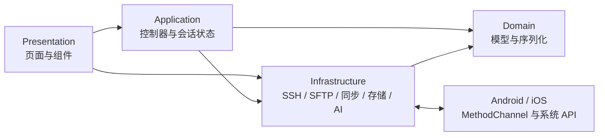
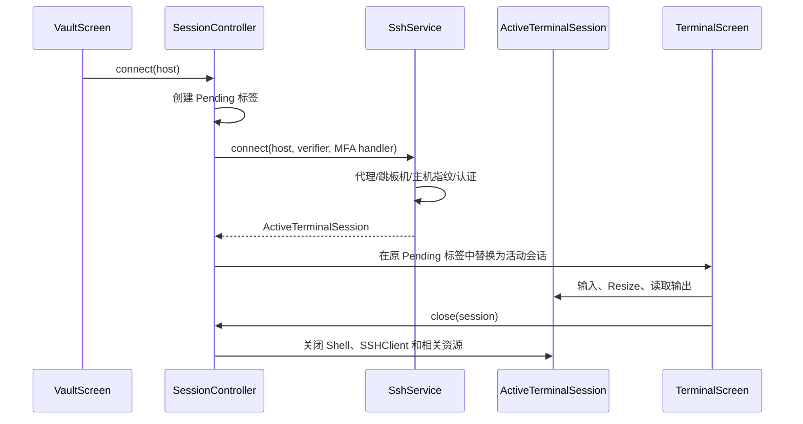

# 架构与关键数据流

## 总览

Netcatty Mobile 是 Flutter 应用，使用 Riverpod 管理全局状态。项目采用分层目录，但当前实现是实用型分层，不是严格的 Clean Architecture：部分页面会直接创建基础设施服务，后续重构时应逐步通过 Provider 或构造参数注入。



依赖边界：

- `domain` 不导入 UI 控件、平台插件或网络客户端。
- `application` 可以协调基础设施服务，但不绘制界面。
- `infrastructure` 负责 I/O、协议和系统交互。
- `presentation` 负责收集用户输入、显示状态和调用控制器/服务。

## 启动与全局状态

`lib/main.dart` 在 `runApp` 前初始化 `VaultRepository`，然后通过 `ProviderScope` 覆盖 `vaultRepositoryProvider`。`NetcattyApp` 读取设置并创建主题，`HomeShell` 管理底部五个主入口：保险库、终端、文件、片段和设置。

主要控制器：

| 控制器 | 状态 | 职责 |
| --- | --- | --- |
| `VaultController` | `VaultState` | 加载、编辑和保存主机、密钥、片段、分组及代理配置 |
| `SessionController` | `SessionState` | 建立连接、维护 Pending 状态、活动标签、分屏与会话关闭 |
| `SettingsController` | `AppSettings` | 主题、主机视图、快捷键等偏好 |
| `PortForwardController` | `List<ActivePortForward>` | 本地转发、动态 SOCKS5 的启动与停止 |

不要在 Widget 中复制控制器已有的状态。需要跨页面共享或需要在页面销毁后继续存在的状态，应放到 `application` 层。

## Vault 与凭据

`VaultData` 聚合以下数据：

- `HostProfile`
- `SshKeyProfile`
- `CommandSnippet`
- 自定义分组
- `ProxyProfile`
- 插件/桌面端侧车字段

`HostProfile` 和 `VaultData` 保存原始 JSON Map，并通过 typed getter 读取移动端认识的字段。这个设计用于兼容桌面端和未来插件字段：反序列化后再序列化时，不能只重建已知字段，否则会丢失桌面端数据。

普通 Vault 快照保存在 `SharedPreferences`，保存前由 `VaultRepository` 分离敏感值；密码、私钥、私钥口令、同步主密码、Provider Token 和 AI API Key 存入 `FlutterSecureStorage`：

- Android：Encrypted Shared Preferences / Keystore
- iOS：Keychain，设备绑定的可访问级别

导出保险库 JSON 是明确的明文迁移操作，可能包含凭据，不能作为日常备份自动写入公共目录。

## SSH 与终端生命周期



`ActiveTerminalSession` 拥有认证后的 `SSHClient`、Shell Channel、xterm2 `Terminal` 和 `TerminalInputController`。后者把底部 Ctrl/Alt/Shift 的一次性修饰状态应用到下一次系统软键盘输入；移动端 TerminalView 启用删除检测以兼容 iOS 输入法的退格事件。SFTP、端口转发、服务器监控和系统管理复用这个 SSH Client，避免重复认证。因此：

- 关闭标签时必须先二次确认，再由 `SessionController` 统一释放资源。
- 同一主机可以建立多个独立 `ActiveTerminalSession`，不能按主机 ID 去重。
- 第二个连接的 Pending/失败状态只属于新标签，不能覆盖当前正在操作的终端。
- 会话关闭后，借用其 SSH Client 的 SFTP、转发或监控操作应停止或报出可理解的错误。

连接能力包括密码、私钥、keyboard-interactive、跳板机、HTTP/SOCKS5 代理、主机指纹确认、启动命令和环境变量。Telnet 使用独立的 option 协商路径。Mosh 目前只有保留入口，没有移动端 UDP 原生运行时。

## 后台与画中画

`ConnectionPlatformService` 通过 `app.netcatty.mobile/connection` 通道通知原生端是否存在活动 SSH 会话。

- Android 启动 `SshKeepAliveService` 前台服务并显示低优先级常驻通知。该服务提高进程存活概率，但网络、系统省电策略和厂商限制仍可能断开连接。
- iOS 只能申请短暂 Background Task 完成正在进行的网络工作，不能把普通 SSH Socket 变成无限后台任务。

`TerminalPictureInPictureService` 使用 `app.netcatty.mobile/picture_in_picture`：

- Android PiP 直接展示实时 Flutter Surface。
- iOS 使用 `AVSampleBufferDisplayLayer` 生成 960×540 终端文本帧，并通过 `AVPictureInPictureController` 展示。渲染坐标系或像素缓冲格式变化时必须在真机检查方向与文字镜像。

画中画是可视化和提高活跃度的辅助能力，不应在文档或 UI 中承诺 iOS 永久保活。

## SFTP 与本地文件

`FileTransferService` 统一抽象远程 SFTP 和本地文件：

```text
FileTransferService
├─ SftpService                      远程 SSH/SFTP
└─ MountableFileTransferService
   ├─ LocalFileTransferService      iOS App Documents / 桌面测试环境
   └─ AndroidDocumentTreeTransferService  Android SAF
```

核心约束：

- `readStream` / `writeStream` 使用 `Stream<Uint8List>`，大文件不能整体加载到内存。
- `transferEntry` 支持递归目录复制和跨服务传输。
- `calculateTransferSize` 在目录传输前计算总字节，用于确定进度。
- 进度 UI 约每 200ms 或 256KB 更新一次，避免因每个数据块 `setState` 导致卡顿。
- iOS 的 SFTP 读写限制 Pending Request 数，并使用有界写入批次，降低 Dart UI Isolate 的加密、Future 调度和 GC 压力。
- Android SAF 数据通过原生 `DocumentTreeChannel` 与缓存文件桥接，目录 URI 权限由系统持久保存。
- iOS 使用 App Documents，`UIFileSharingEnabled` 和 `LSSupportsOpeningDocumentsInPlace` 让用户从“文件”App 访问 Netcatty 文件夹。

新增传输协议或本地 Provider 时，应实现 `FileTransferService`，不要把平台判断散落到双栏页面。

多选操作由 `FileSelection` 保存源服务与不可变条目列表，两栏共享文件剪贴板。单文件跨栏复制也通过同一 `_paste` / `transferSelection` 入口。`prepareTransferRoute` 选择 `serverLocal`、`serverDirect` 或 `phoneRelay`：端点/用户/路由一致（包括不同 SSH 标签页和重复保存的资料）优先服务器内 `cp -RP` / `mv -nT`，不递归扫描大小；不同服务器由源端执行 OpenSSH SFTP 上传，文件数据不经过手机；手机来源直接使用流式传输。远程预检查不通过时返回原因，由 UI 询问后才使用手机中转，取消不会隐式视为同意。

直传固定使用配置中的用户名/主机/端口，启用 BatchMode、严格主机密钥验证、连接超时和保活；忽略源端 SSH 配置文件和 agent，不转发 agent、不接受新指纹、不上传手机私钥或密码，仅使用源端已有的默认磁盘密钥与 known_hosts。目标有手机端代理/跳板机配置、批处理路径含换行、目录含符号链接/特殊文件时，保守提示中转。OpenSSH SFTP 递归上传会跳过符号链接，不能将这种跳过当作完整复制。Shell 路径和 SFTP 批处理路径使用不同转义规则，后者通过实际 OpenSSH `sftp -D` 测试验证。参考 [OpenSSH SFTP 文档](https://man.openbsd.org/sftp.1)。

`transferSelection` 预检查重名、路径自身及 SFTP realpath 解析后的自身子目录。服务器复制先在目标目录内创建独立 UUID 临时目录（0700），成功后由目标端 `mv -nT` 发布，拒绝覆盖或意外嵌套进同名目录；不使用 dartssh2 默认的 posix-rename 覆盖语义。需要服务器支持 `cp -RP` / `mv -nT`，不自动安装命令或提权。跨服务器直传会核对完整目录树、文件类型/大小及源文件是否变化，移动仅在发布成功且再检查源文件后删除原件（不是内容哈希校验）。流式中转移动保留原有的删除前校验；同会话的中转兼容路径仍使用 SFTP rename。

每个远程操作使用独立 SSH exec channel，取消只发送该任务的 TERM 并关闭 channel，不断开用户终端。服务器可能忽略信号，因此失败后不自动转中转、不复用或清理可能仍被写入的 `.netcatty-transfer-<uuid>` 目录，提示用户检查；不能把它描述成已可靠停止的后台任务。成功后尽力清理空临时目录。直传不是脱离 App 生命周期的后台作业。大文件的进度每秒查询目标临时文件大小，目录操作展示阶段及完成项数，不伪造精确百分比。失败保留未完成剪贴板；挂载目录变化清空剪贴板，传输期间禁止重新挂载。

批量粘贴不复用未知来源的旧分块临时文件，避免不同源的同名文件混合后误删原件；原有单文件流式中转的断点续传行为保持不变。相同端点/用户/路由的不同标签或重复资料也参与“复制到自身”检查；直传中如果源端可见新建的目标临时目录，还会检查它是否落入源目录，防止别名端点或共享存储造成递归自复制。

`RemoteArchive` 只负责已转义的远程命令，缺少服务端工具时不自动安装；远程解压要求新建目标目录，手机侧无解压入口。多选压缩在远程使用 tar/zip，手机侧由 `zipSelection` 流式生成 ZIP，使用临时文件、CRC32 和数据描述符，不支持 ZIP64；失败清理自己的临时文件。

`SftpEditor` 捕获打开文件时的服务，保存失败保留编辑缓冲区；行号与文本共享垂直滚动，关闭自动换行时文本可水平滚动。开启自动换行后，行号栏使用与编辑区相同的字体、缩放比例、行高和可用宽度测量视觉行，逻辑行号仅显示在首个视觉行，后续折行留空。编辑区使用原始指针监听实现双指缩放（6–32 pt），不会占用单指文本选择手势，行号与折行测量随字号同步更新。文件内搜索由 `findEditorMatches` 生成非重叠 `TextRange`，支持普通文本、Unicode 全词边界、正则表达式和大小写选项；无效正则只显示错误，不改变文件。结果最多保留 10000 个范围，超限计数显示 `+`，搜索结果在 `CodeTextController` 中与语法着色合并绘制，导航时同步选择并按视觉行滚动。`CodeTextController` 提供轻量语法着色，不是完整语言解析器，超过 20 万字符或输入法正在组合文本时不高亮。`AppSettings.sftpSyntaxHighlight` 控制开关，默认开启。

## 服务器识别与性能监控

`ServerMonitorService` 通过远程命令采集：

- 系统名称、发行版、主机名、内核、CPU 核心数
- CPU、内存和根分区占用
- 网络收发吞吐、系统负载、运行时间
- 每核心 CPU 差分、型号/架构/频率；内存空闲/可用/缓存及 Swap；已挂载分区使用；已建立 TCP 连接数

每个 `ActiveTerminalSession` 持有独立的 `SessionMonitor`。`SessionController` 在连接完成后立即启动，随后每 3 秒采样且不重叠请求，缓存最近 60 个样本。监控弹窗只订阅缓存，关闭弹窗不停止采集；断开、关闭会话或 Controller 销毁时停止定时器。重连使用新会话/新采样器，避免沿用旧计数差分。新增详细指标主要由 Linux `/proc`、`df`、`ss` 提供，缺少字段时使用空值，不自动申请提权。

资源详情以高度与透明度动画展开/收起，尊重系统减少动画设置。`ServerNetworkChart` 显示三分钟时间轴；触摸/横向拖动选择最近的真实采样点并展示本地采样时间和收发速率，接触期间冻结图表快照，松开/取消后恢复实时数据。网络累计量直接来自 `NET` 原始接口计数（不是 SSH 会话流量，也不是对三分钟曲线积分），缺失时显示未知，网卡重置可能让累计值归零。

结果映射到 `ServerSystemInfo` / `ServerStats`。识别结果回写主机资料，用于 `HostSystemIcon` 选择发行版图标。远程环境可能缺少某些命令，因此解析器必须容忍空字段和不同发行版输出。

## 系统管理

`SystemManagementService` 将远程命令输出转换为 `domain/models/system_management.dart` 中的模型。UI 由 `SystemManagementSheet` 和六组 Panel 组成：

- `ProcessManagerPanel`
- `DockerManagerPanel`
- `DockerComposePanel`
- `ServiceManagerPanel`
- `CaddyManagerPanel`
- `TmuxManagerPanel`

Docker、服务与 Caddy 管理调用会探测直接访问、免密 sudo 和需要密码的 sudo。服务面板自动识别 systemd/OpenRC，并提供启动、停止、重启和开机自启管理。Caddy 面板先通过 `command -v caddy` 检测安装状态；Netcatty 创建的站点直接写入主 Caddyfile，每段配置使用 `netcatty-begin` / `netcatty-end` 标记和元数据，用户可在同一个文件中查看或继续手动维护。增删操作使用主配置备份和同目录临时文件，依次执行 `caddy fmt`、`caddy validate` 和 `caddy reload`，任一步失败都会恢复完整主配置后尝试重新加载旧配置。列表仅解析带 Netcatty 标记的配置块，不解析或删除用户已有的复杂手写站点。破坏性操作（KILL、删除容器/镜像、Compose Down、删除反代站点等）必须保留二次确认。远程命令参数要经过 Shell 转义，解析逻辑应配套单元测试。

## 云同步

`CloudSyncService` 支持 WebDAV、GitHub 私有 Gist 和 S3。GitHub 登录使用 OAuth Device Flow，访问 Token 保存到安全存储；同步主密码与 Provider Token 分离。

`NetcattyCrypto` 的 wire format：

1. 生成 32 字节随机 Salt。
2. PBKDF2-HMAC-SHA256 迭代 600,000 次，派生 256 位密钥。
3. 生成 12 字节随机 Nonce。
4. AES-256-GCM 加密，128 位 Tag 附加到 Ciphertext。
5. 将 Base64 字段写入 `{meta, payload}`。

仓库包含由另一运行时产生的兼容向量。修改 KDF、Nonce、Tag 拼接方式、JSON 结构或字符编码时，必须保留旧格式解密能力并补充跨运行时测试。

移动端与桌面端共用 Git 风格的三方合并语义：`base` 是上次成功同步的共同快照，`local` 是手机当前数据，`remote` 是本次下载的云端数据。实体按 ID（`groupConfigs` 按 path）逐项比较；单侧删除且另一侧未修改时删除生效，删除与编辑冲突时保留编辑，双方同时编辑时按桌面端规则优先本地。首次同步没有可信 base 时按 ID 并集合并，并使用桌面端 `syncMeta.deletions` 墓碑抑制旧设备残留。

共同 base 以完整加密保险库写入本地同步检查点，不保存明文凭据。每次上传重新生成桌面兼容的 `syncMeta`，记录删除实体并携带仍有效的历史墓碑。`lastConnectedAt` 和 `knownHosts` 属于设备本地状态，不进入云端比较或上传；旧版 `_netcattyMobileSync` 私有时钟也会在同步时清理。WebDAV 使用临时 PUT + MOVE/覆盖校验，GitHub Gist 与 S3 在写入前重新读取并核对修订标识。远端在同步窗口中变化时最多重新拉取合并三次，避免最后写入者静默覆盖。

保险库加载采用快照优先策略：主机元数据、分组和命令片段从 SharedPreferences 内存快照同步提供给 UI，密码、私钥和代理凭据随后从系统安全存储并行补齐。`VaultController.ready()` 是连接、编辑、导出和持久化操作的同步屏障；只读列表不得等待逐项 Keychain/Keystore 查询，也不得用尚未补齐敏感字段的快照覆盖完整保险库。

客户端在本地保存最近一次成功同步的版本号、云端数据指纹与加密共同 base。设置页读取加密文件公开的 `meta.version` 作为云端版本，并通过忽略同步时间、可靠性元数据和连接时间的桌面端数据投影判断本地是否存在待同步修改；检查点不保存明文保险库或同步密码。

`AutoSyncController` 和设置页唯一的“立即同步”按钮复用同一个 `CloudSyncService.synchronize` 流程。自动同步默认关闭；开启后会在本地 Vault 修改约 10 秒后同步，在应用启动、返回前台及每 5 分钟检查云端。存储层区分本地修改与云端应用事件，避免下载结果再次触发上传循环；同步请求期间出现的新本地修改会以请求开始时的快照为 base 再做一次三方合并，然后排队补充同步。每次应用合并结果前都会从最新本地快照重新附加 `knownHosts` 和 `lastConnectedAt` 等设备本地字段，防止连接期间与自动同步并发时丢失服务器指纹信任记录。

## 更新检查

`UpdateCheckService` 调用 GitHub REST API 的 `releases/latest` 端点，读取最新正式 Release 的 `tag_name` 和 `html_url`。设置页使用 `package_info_plus` 获取当前应用版本，忽略 Tag 的 `v` 前缀和 Build Metadata 后进行语义版本比较：

- 版本相同：显示“已是最新版本”。
- GitHub 版本更高：显示可用更新和最新版本号。
- 当前版本更高：标记为开发版本，不错误提示降级更新。
- 网络或响应异常：显示可重试错误，不影响设置页其他功能。

成功状态的卡片始终可跳转到对应 GitHub Release；返回 URL 只接受 `https://github.com`，否则回退到仓库固定的 `/releases/latest` 页面。检查请求不携带 GitHub Token，也不应因为版本检查失败阻塞应用启动。

## 主题与资源

`presentation/theme.dart` 保存桌面端迁移的主题预设；发行版和 Docker 图标分别位于 `assets/distro` 与 `assets/docker`。主题颜色会同时影响应用组件、终端和 iOS PiP 文本帧。

新增资源后必须：

1. 放入 `assets/` 对应子目录。
2. 确认 `pubspec.yaml` 已声明资源目录。
3. 在浅色和深色主题、窄屏与横屏中检查对比度和布局。

## 错误处理原则

- 网络和远程命令错误转换为用户可理解的信息，但不要把密码、Token 或完整命令环境写入日志。
- Pending 状态、Transfer 状态和 Sheet 加载状态应绑定到发起操作的对象，避免全屏覆盖其他会话。
- 页面销毁后异步回调必须检查 `mounted`。
- 原生 MethodChannel 必须对不支持的平台返回可处理的 `false`/`null` 或明确异常，不能让 UI 永久等待。
