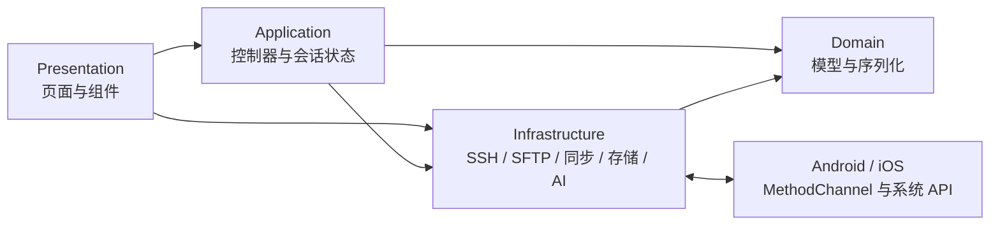
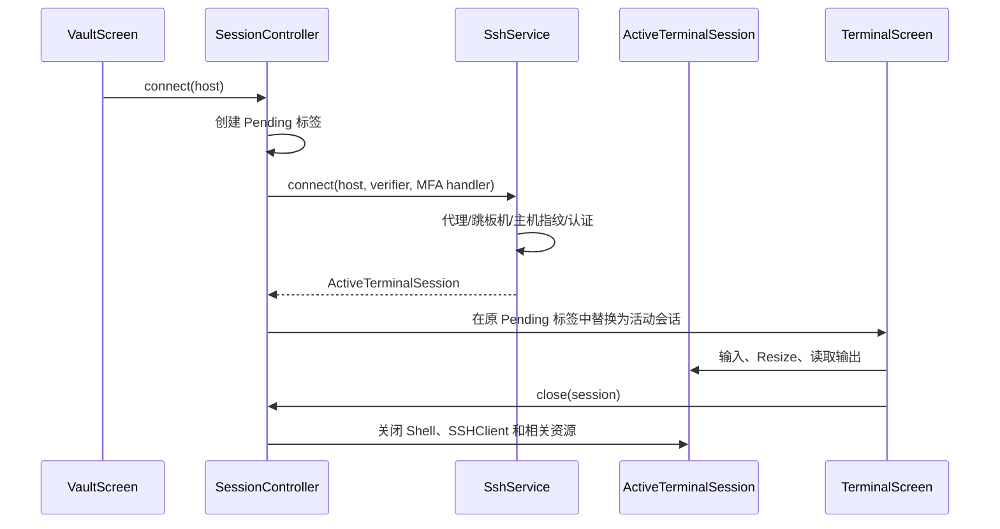

# 架构与关键数据流

## 总览

Netcatty Mobile 是 Flutter 应用，使用 Riverpod 管理全局状态。项目采用分层目录，但当前实现是实用型分层，不是严格的 Clean Architecture：部分页面会直接创建基础设施服务，后续重构时应逐步通过 Provider 或构造参数注入。



依赖边界：

- `domain` 不导入 UI 控件、平台插件或网络客户端。
- `application` 可以协调基础设施服务，但不绘制界面。
- `infrastructure` 负责 I/O、协议和系统交互。
- `presentation` 负责收集用户输入、显示状态和调用控制器/服务。

## 启动与全局状态

`lib/main.dart` 在 `runApp` 前初始化 `VaultRepository`，然后通过 `ProviderScope` 覆盖 `vaultRepositoryProvider`。`NetcattyApp` 读取设置并创建主题，`HomeShell` 管理底部五个主入口：保险库、终端、文件、片段和设置。

主要控制器：

| 控制器 | 状态 | 职责 |
| --- | --- | --- |
| `VaultController` | `VaultState` | 加载、编辑和保存主机、密钥、片段、分组及代理配置 |
| `SessionController` | `SessionState` | 建立连接、维护 Pending 状态、活动标签、分屏与会话关闭 |
| `SettingsController` | `AppSettings` | 主题、主机视图、快捷键等偏好 |
| `PortForwardController` | `List<ActivePortForward>` | 本地转发、动态 SOCKS5 的启动与停止 |

不要在 Widget 中复制控制器已有的状态。需要跨页面共享或需要在页面销毁后继续存在的状态，应放到 `application` 层。

## Vault 与凭据

`VaultData` 聚合以下数据：

- `HostProfile`
- `SshKeyProfile`
- `CommandSnippet`
- 自定义分组
- `ProxyProfile`
- 插件/桌面端侧车字段

`HostProfile` 和 `VaultData` 保存原始 JSON Map，并通过 typed getter 读取移动端认识的字段。这个设计用于兼容桌面端和未来插件字段：反序列化后再序列化时，不能只重建已知字段，否则会丢失桌面端数据。

普通 Vault 快照保存在 `SharedPreferences`，保存前由 `VaultRepository` 分离敏感值；密码、私钥、私钥口令、同步主密码、Provider Token 和 AI API Key 存入 `FlutterSecureStorage`：

- Android：Encrypted Shared Preferences / Keystore
- iOS：Keychain，设备绑定的可访问级别

导出保险库 JSON 是明确的明文迁移操作，可能包含凭据，不能作为日常备份自动写入公共目录。

## SSH 与终端生命周期



`ActiveTerminalSession` 拥有认证后的 `SSHClient`、Shell Channel、xterm2 `Terminal` 和 `TerminalInputController`。后者把底部 Ctrl/Alt/Shift 的一次性修饰状态应用到下一次系统软键盘输入；移动端 TerminalView 启用删除检测以兼容 iOS 输入法的退格事件。SFTP、端口转发、服务器监控和系统管理复用这个 SSH Client，避免重复认证。因此：

- 关闭标签时必须先二次确认，再由 `SessionController` 统一释放资源。
- 同一主机可以建立多个独立 `ActiveTerminalSession`，不能按主机 ID 去重。
- 第二个连接的 Pending/失败状态只属于新标签，不能覆盖当前正在操作的终端。
- 会话关闭后，借用其 SSH Client 的 SFTP、转发或监控操作应停止或报出可理解的错误。

连接能力包括密码、私钥、keyboard-interactive、跳板机、HTTP/SOCKS5 代理、主机指纹确认、启动命令和环境变量。Telnet 使用独立的 option 协商路径。Mosh 目前只有保留入口，没有移动端 UDP 原生运行时。

## 后台与画中画

`ConnectionPlatformService` 通过 `app.netcatty.mobile/connection` 通道通知原生端是否存在活动 SSH 会话。

- Android 启动 `SshKeepAliveService` 前台服务并显示低优先级常驻通知。该服务提高进程存活概率，但网络、系统省电策略和厂商限制仍可能断开连接。
- iOS 只能申请短暂 Background Task 完成正在进行的网络工作，不能把普通 SSH Socket 变成无限后台任务。

`TerminalPictureInPictureService` 使用 `app.netcatty.mobile/picture_in_picture`：

- Android PiP 直接展示实时 Flutter Surface。
- iOS 使用 `AVSampleBufferDisplayLayer` 生成 960×540 终端文本帧，并通过 `AVPictureInPictureController` 展示。渲染坐标系或像素缓冲格式变化时必须在真机检查方向与文字镜像。

画中画是可视化和提高活跃度的辅助能力，不应在文档或 UI 中承诺 iOS 永久保活。

## SFTP 与本地文件

`FileTransferService` 统一抽象远程 SFTP 和本地文件：

```text
FileTransferService
├─ SftpService                      远程 SSH/SFTP
└─ MountableFileTransferService
   ├─ LocalFileTransferService      iOS App Documents / 桌面测试环境
   └─ AndroidDocumentTreeTransferService  Android SAF
```

核心约束：

- `readStream` / `writeStream` 使用 `Stream<Uint8List>`，大文件不能整体加载到内存。
- `transferEntry` 支持递归目录复制和跨服务传输。
- `calculateTransferSize` 在目录传输前计算总字节，用于确定进度。
- 进度 UI 约每 200ms 或 256KB 更新一次，避免因每个数据块 `setState` 导致卡顿。
- iOS 的 SFTP 读写限制 Pending Request 数，并使用有界写入批次，降低 Dart UI Isolate 的加密、Future 调度和 GC 压力。
- Android SAF 数据通过原生 `DocumentTreeChannel` 与缓存文件桥接，目录 URI 权限由系统持久保存。
- iOS 使用 App Documents，`UIFileSharingEnabled` 和 `LSSupportsOpeningDocumentsInPlace` 让用户从“文件”App 访问 Netcatty 文件夹。

新增传输协议或本地 Provider 时，应实现 `FileTransferService`，不要把平台判断散落到双栏页面。

## 服务器识别与性能监控

`ServerMonitorService` 通过远程命令采集：

- 系统名称、发行版、主机名、内核、CPU 核心数
- CPU、内存和根分区占用
- 网络收发吞吐、系统负载、运行时间

结果映射到 `ServerSystemInfo` / `ServerStats`。识别结果回写主机资料，用于 `HostSystemIcon` 选择发行版图标。远程环境可能缺少某些命令，因此解析器必须容忍空字段和不同发行版输出。

## 系统管理

`SystemManagementService` 将远程命令输出转换为 `domain/models/system_management.dart` 中的模型。UI 由 `SystemManagementSheet` 和四组 Panel 组成：

- `ProcessManagerPanel`
- `DockerManagerPanel`
- `DockerComposePanel`
- `TmuxManagerPanel`

Docker 调用会探测直接访问、免密 sudo 和需要密码的 sudo。破坏性操作（KILL、删除容器/镜像、Compose Down 等）必须保留二次确认。远程命令参数要经过 Shell 转义，解析逻辑应配套单元测试。

## 云同步

`CloudSyncService` 支持 WebDAV、GitHub 私有 Gist 和 S3。GitHub 登录使用 OAuth Device Flow，访问 Token 保存到安全存储；同步主密码与 Provider Token 分离。

`NetcattyCrypto` 的 wire format：

1. 生成 32 字节随机 Salt。
2. PBKDF2-HMAC-SHA256 迭代 600,000 次，派生 256 位密钥。
3. 生成 12 字节随机 Nonce。
4. AES-256-GCM 加密，128 位 Tag 附加到 Ciphertext。
5. 将 Base64 字段写入 `{meta, payload}`。

仓库包含由另一运行时产生的兼容向量。修改 KDF、Nonce、Tag 拼接方式、JSON 结构或字符编码时，必须保留旧格式解密能力并补充跨运行时测试。

每次本地修改会为记录写入修订时钟，删除则写入加密墓碑；设备 ID 由安全的本地持久化标识提供，而不是每次启动重新生成。拉取和上传都先执行记录级合并：WebDAV 使用 ETag 条件写入，GitHub Gist 因更新接口不支持不安全方法的条件请求，改为在 PATCH 前重新读取并核对 ETag，确认云端未变化后再写入。远端在同步窗口中发生变化时最多重新拉取合并三次，避免最后写入者静默覆盖。同步同时保留远端未知字段，不把“同步成功”等同于简单覆盖上传。

保险库加载采用快照优先策略：主机元数据、分组和命令片段从 SharedPreferences 内存快照同步提供给 UI，密码、私钥和代理凭据随后从系统安全存储并行补齐。`VaultController.ready()` 是连接、编辑、导出和持久化操作的同步屏障；只读列表不得等待逐项 Keychain/Keystore 查询，也不得用尚未补齐敏感字段的快照覆盖完整保险库。

客户端在本地保存最近一次成功同步的版本号与保险库指纹。设置页读取加密文件公开的 `meta.version` 作为云端版本，并通过当前保险库指纹判断本地是否存在待同步修改；该检查不保存明文保险库或同步密码。

`AutoSyncController` 复用同一套拉取、记录级合并和条件写入流程。自动同步默认关闭；开启后会在本地 Vault 修改约 3 秒后同步，在应用启动、返回前台及每 5 分钟检查云端。存储层区分本地修改与云端应用事件，避免下载结果再次触发上传循环；同步请求期间出现的新本地修改会先合并回结果，再排队补充一次同步。

## 更新检查

`UpdateCheckService` 调用 GitHub REST API 的 `releases/latest` 端点，读取最新正式 Release 的 `tag_name` 和 `html_url`。设置页使用 `package_info_plus` 获取当前应用版本，忽略 Tag 的 `v` 前缀和 Build Metadata 后进行语义版本比较：

- 版本相同：显示“已是最新版本”。
- GitHub 版本更高：显示可用更新和最新版本号。
- 当前版本更高：标记为开发版本，不错误提示降级更新。
- 网络或响应异常：显示可重试错误，不影响设置页其他功能。

成功状态的卡片始终可跳转到对应 GitHub Release；返回 URL 只接受 `https://github.com`，否则回退到仓库固定的 `/releases/latest` 页面。检查请求不携带 GitHub Token，也不应因为版本检查失败阻塞应用启动。

## 主题与资源

`presentation/theme.dart` 保存桌面端迁移的主题预设；发行版和 Docker 图标分别位于 `assets/distro` 与 `assets/docker`。主题颜色会同时影响应用组件、终端和 iOS PiP 文本帧。

新增资源后必须：

1. 放入 `assets/` 对应子目录。
2. 确认 `pubspec.yaml` 已声明资源目录。
3. 在浅色和深色主题、窄屏与横屏中检查对比度和布局。

## 错误处理原则

- 网络和远程命令错误转换为用户可理解的信息，但不要把密码、Token 或完整命令环境写入日志。
- Pending 状态、Transfer 状态和 Sheet 加载状态应绑定到发起操作的对象，避免全屏覆盖其他会话。
- 页面销毁后异步回调必须检查 `mounted`。
- 原生 MethodChannel 必须对不支持的平台返回可处理的 `false`/`null` 或明确异常，不能让 UI 永久等待。
